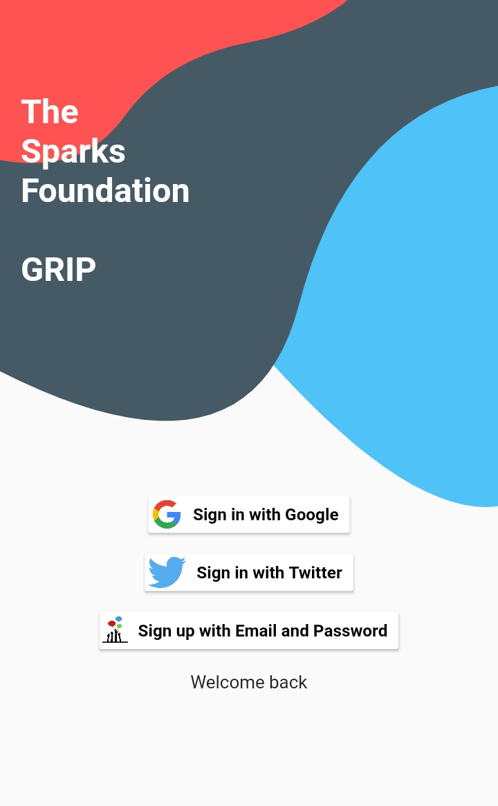

# Social Media Intergation App (Task #5) , done for The Sparks Foundation as GRIP 
[][youtube]

Learn how to integrate Signin with Google,Twitter and your own app with Firebase and Flutter.

### ⚡&ensp;Social Media

&ensp;Twitter: [@CharmiShah](https://twitter.com/CharmiShah26)

&ensp;Linkedin: [@ Charmi Shah](https://www.linkedin.com/in/charmishah2611/)

### ✌&ensp;Preview

|              App Preview             |             Screenshot            |
| :----------------------------------: | :----------------------------------: |
|  | </a> |

### 📺&ensp;Watch Video

##### [YouTube video](https://youtu.be/nIDwdsNfGcM "Youtube Charmi Shah") where the *implementation* is showed. [Subscribe YouTube channel.](https://youtu.be/nIDwdsNfGcM "YouTube Subscribe Charmi Shah")  

[twitter]: https://twitter.com/intent/follow?original_referer=https%3A%2F%2Fgithub.com%2FJohannesMilke&screen_name=JohannesMilke
[youtube]: https://youtu.be/nIDwdsNfGcM
